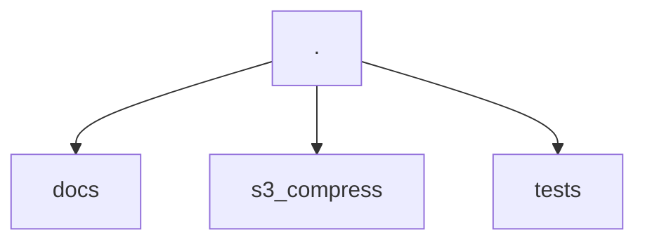
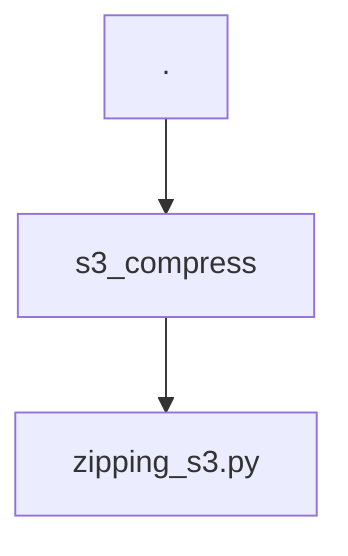
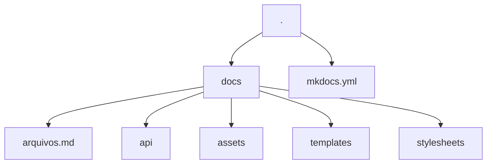

# How to contribute

Thank you for your interest in contributing to the `S3 Simple Compress ZIP` project :heart:. In this document, we have listed the most common operations you may need to contribute.

## How does the project work?

### Project structure



The project is divided into three directories: `docs`, `s3_compress`, and `tests`. Each directory has its specific function.

#### s3_compress



The CLI and library code are in `s3_compress`. The code's API documentation is also being done in `s3_compress`. Using the [mkdocstrings](https://mkdocstrings.github.io/) tool and follows the [Google docstrings](https://sphinxcontrib-napoleon.readthedocs.io/en/latest/example_google.html) pattern. So, if you change anything in the code, remember to update the docstrings as well.

The examples used in the docstring are also being used for testing. So if you change the output format, remember to update the docstrings.


#### tests

For tests, we are using [pytest](https://docs.pytest.org/). Its configurations can be found in the [pyproject.toml](https://github.com/BrunoMesquitaa/s3_simple_compress/blob/main/pyproject.toml) file in the root of our project.

Important things you need to know about the tests are that not all tests are only in the `tests` directory.

The test coverage is being automatically generated with [pytest-cov](https://github.com/pytest-dev/pytest-cov) and is displayed when the test task is executed:


```bash
task tests
```

Just like the linters are requirements for these tests.

#### Documentation

The entire documentation is based on the use of [mkdocs](https://www.mkdocs.org/) with the [mkdocs-material](https://squidfunk.github.io/mkdocs-material/) theme.



The entire configuration can be found in the [mkdocs.yml](https://github.com/BrunoMesquitaa/s3_simple_compress/blob/main/mkdocs.yml) file at the root of the repository.

Various artifices are also being used to complement the documentation. Such as templates from [jinja](https://jinja.palletsprojects.com/en/3.1.x/) where instructions can be repeated. If you encounter blocks like:


```html
{ %  % }
```

You will know that it is a template.

The templates are defined in the `/docs/templates` directory. 

##### API Documentation

The API documentation is being done within the code modules. That is why the files in the `docs/api` directory have a tag:

```md
::: modulo
```

This means that the code contained in the docstrings in this block will be used. The [mkdocstrings](https://mkdocstrings.github.io/) plugin is being used to take care of this.

The documentation in the modules follows the [Google docstrings](https://sphinxcontrib-napoleon.readthedocs.io/en/latest/example_google.html) format, which is the library's standard.

## Tools

This project basically uses two tools as the basis for all control:

- [Poetry](https://python-poetry.org/): For managing the environment and installing libraries.
- [Boto3](https://github.com/boto/boto3): Boto3 is the official Python library for Amazon Web Services (AWS) that provides an application programming interface (API) for working with AWS services.

So, make sure you have Poetry installed for this contribution:

```bash
pip install poetry
```


## Steps to perform specific tasks

Here are listed commands that you can use to perform routine tasks. Such as cloning the repository, installing dependencies, running tests, and so on...

### How to clone the repository

```bash
git clone https://github.com/BrunoMesquitaa/s3_simple_compress.git
```

### How to install dependencies

```bash
poetry install
```

### How to run code verification

```bash
task check_code
```

### How to update the code (PEP-8)

```bash
task fix_code
```

### How to run tests

```bash
task test
```

### How to view coverage

```bash
task see_cov
```

### How to run documentation

```bash
task docs
```

## Can't find what you need here

If you haven't found what you need, you can open an [issue on the project](https://github.com/BrunoMesquitaa/s3_simple_compress/issues) reporting what you can't do or what needs to be better documented.

## Continuous improvement

This document can be improved by anyone who is interested in improving it. So feel free to provide more tips to people who want to contribute too :heart:
