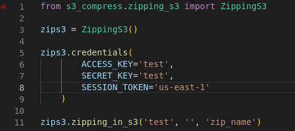

# S3 Simple Compress
## Documentação do programa de compactação (zip) de arquivos no S3 da AWS



## Visão geral

O programa de compactação (zip) de arquivos no S3 da AWS é uma ferramenta que permite aos usuários compactar um ou mais arquivos armazenados no S3 em um único arquivo zip tudo isso em memoria sem a necessidade de ter que baixar no seu Hard Disk. Isso pode ser útil para reduzir o tamanho dos arquivos e economizar custos de armazenamento.

## Requisitos

Antes de começar a usar o programa de compactação (zip) de arquivos no S3 da AWS, você precisará ter o seguinte:
```bash
Uma conta da AWS
Acesso ao serviço S3 da AWS
Conhecimento básico sobre a linha de comando e AWS
```
## Instalação



## Como usar o programa

Para usar o programa de compactação (zip) de arquivos no S3 da AWS, siga as etapas abaixo:
```bash
Primeiro devemos importar nossa Package
Em seguida instânciar a classe
Podemos ou nao ter que chamar o metodo `credentials`, vai depender se ja existir `~/.aws/credentials` ou nao
Por fim so precisamos chamar o metodo `zipping_in_s3`
```
O programa irá compactar os arquivos especificados e salvar o arquivo zip compactado no bucket S3 especificado.

## Exemplo de código

{ width="500" }

Aqui está um exemplo de código Python que implementa a funcionalidade de compactação (zip) de arquivos no S3 da AWS 100% em memoria.